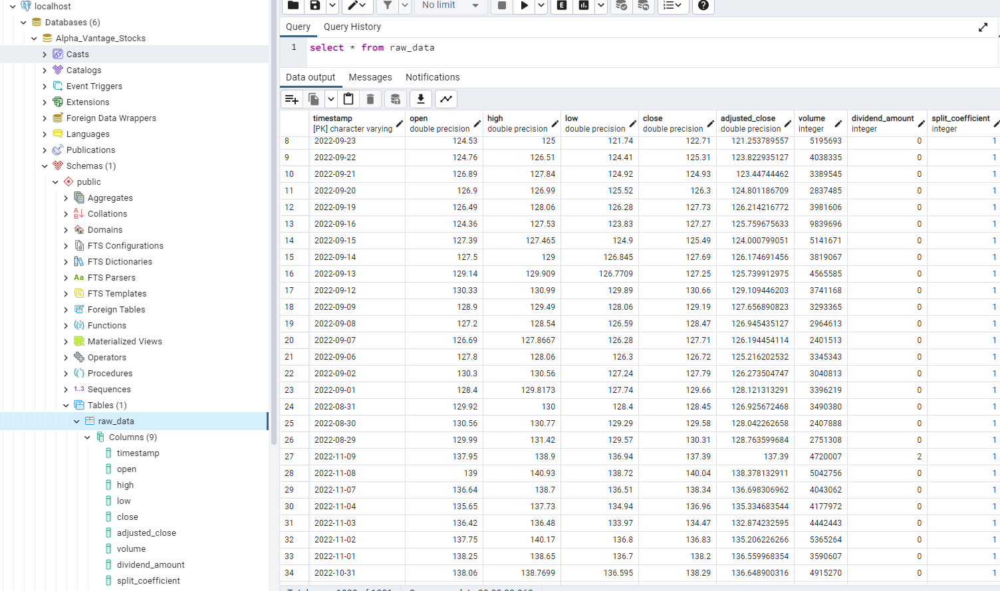
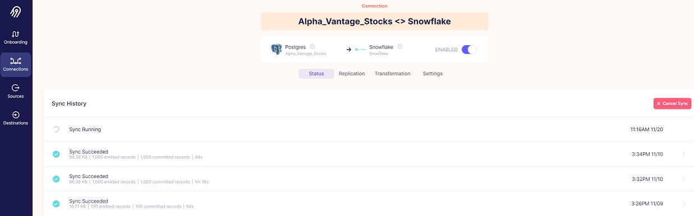
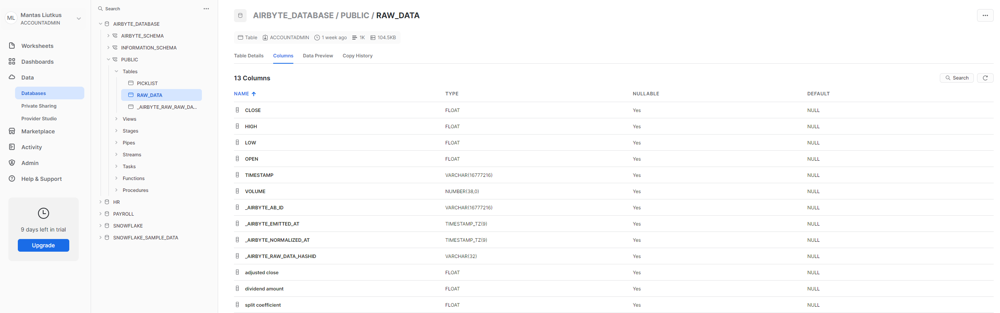
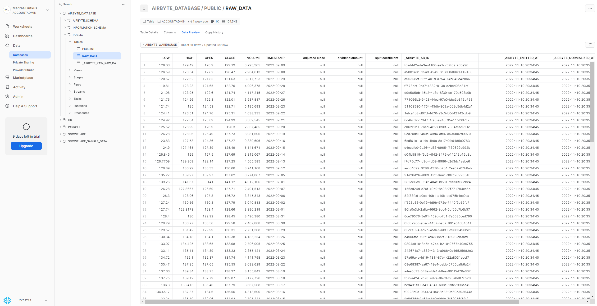
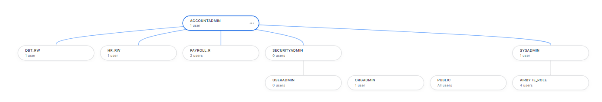
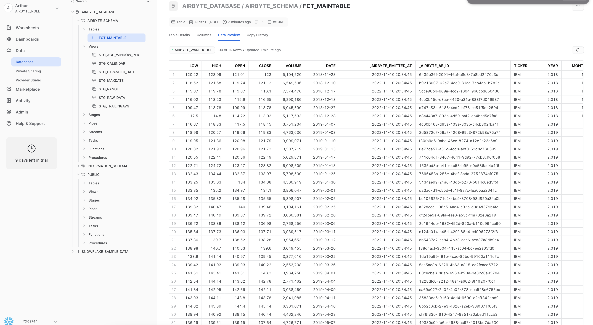

 
  

<h1 align="center"> <b> Single Stock Analytics ELT </b> </h1>
<h3 align="center"> Data Engineer Camp - Group Project #2 - Nov 2022 </h3>  

---

## Objective

The purpose of this project was to create a data engineering pipeline that extracts, loads and transforms a single set of stock data from the [Alpha Vantage API](https://www.alphavantage.co/documentation/) for use as a source in a BI tool of choice.

## Source dataset

The pipeline currently contains the following dataset:

- [Intraday](https://www.alphavantage.co/query?function=TIME_SERIES_INTRADAY&symbol=IBM&interval=5min&apikey=QB4Z8IGGKJNRB5Q1) for a single company (IBM)

## Architecture

 
  

### EXTRACT

- Data extraction form the API https://www.alphavantage.co/
- Sign up to receive API Key: https://www.alphavantage.co/support/#api-key
- API parameters can be found: https://www.alphavantage.co/documentation/

### LOAD

- Load to Postgres: 
  - Using SQLalchemy create the engine API to Postgres;
  - Use the "secrets_config" to enter Postgres credentials;

 
  

- Use Airbyte to connect Postgres to Snowflake:

 
  

- Push data into the Snowflake RAW table:

 
  

 
  

- Create in Snowflake user, roles, database and warehouse. Grand user access to the loaded data:

 
  

### TRANSFORM (Arthur)

- dbt core applied to Snowflake cloud data warehouse to take full advantage of analytical engineering practices:  version control, documentation, and modularity of sql code

 
  

- Transformation features:  Basic SQL transforms, packages, seeds, macros, genneric tests, singular tests, source freshness checks, documentation and interdependencies

 
  

 
  

- Final serving table intented to be imported and analyzed into BI tool of choice with minimal additional transormations required (headless)

### FUTURE WORK

- Integrate custom Airbyte API into extract and load process to bypass postgres staging
- Apply orchestration, process dependencies, and logging with Airbyte
- Package and host full pipeline in the cloud

