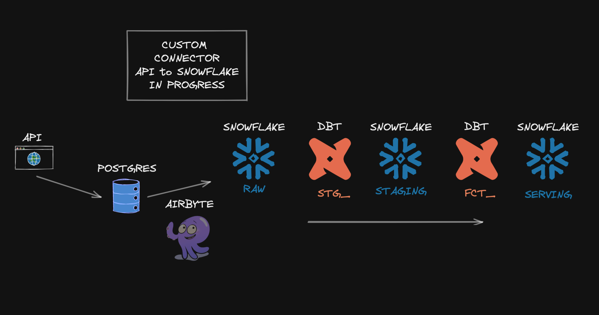

 
  

<h1 align="center"> <b> Single Stock Analytics ELT </b> </h1>
<h3 align="center"> Data Engineer Camp - Group Project #2 - Nov 2022 </h3>  

---

## Objective (INCOMPLETE)

This is a data engineering pipeline that extracts, loads and transforms multiple sets of economic and financial data from the [Alpha Vantage API](https://www.alphavantage.co/documentation/). 

The output of the pipeline could be used by data/business analysts, investment managers and other finance professionals, data and finance journalists alike, depending on the specific use case.

The data allows data analysts to investigate correlations and derive hypotheses on causation between those data points. These data points would also show the financial and economic changes coinciding with [black swan events](https://www.investopedia.com/terms/b/blackswan.asp) such as the outbreak of the COVID-19 pandemic in 2019 and Russia’s invasion of Ukraine in 2022.

## Source dataset (INCOMPLETE)

The pipeline currently contains the following datasets:

- [Foreign Exchange (FX) daily exchange rates](https://www.alphavantage.co/documentation/#currency-exchange) for different countries' currencies compared against the US Dollar. The current pipeline defaults to exchange rates against the AUD, EUR, JPY, RUB and GBP respectively.

## Architecture (INCOMPLETE)

- Object-oriented Python extraction using requests and pandas with integrated logging, testing, and yaml configuration for user input
- Upsert load to Postgres with sqlalchemy and database transformations using modularized sql with jinja templating
- Dockerizing and serving ELT pipeline on AWS with use of ECS, ECR, S3, RDS, and IAM

 
  

